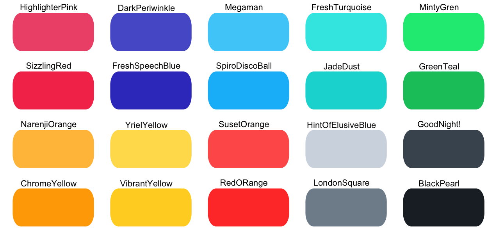

# flatuicoloRs

The goal of `flatuicoloRs` is to make available web-safe color palettes from the popular 
[flatuicolors](https://flatuicolors.com/) in `R`. All the major credit goes to [Ahmet Sülek](https://medium.com/@ahmetsulek) and rest of the [contributors](https://medium.com/collect-ui-design-ui-ux-inspiration-blog/flat-ui-colors-2-13-countries-13-designers-13-color-palettes-more-1d0ecdd66301).

For details and an interactive palette selection visit [flatuicolors.com](https://flatuicolors.com/)

There are total 15 color palettes available.

* Two flat palettes: `flatUIv1` and `materialui`
* 13 palettes from [13 different countries](https://medium.com/collect-ui-design-ui-ux-inspiration-blog/flat-ui-colors-2-13-countries-13-designers-13-color-palettes-more-1d0ecdd66301).


### Installation and Usage

You can install `flatuicoloRs` using `remotes`, `devtools`, or `BiocManager`

```r
#Isntall using remotes
> remotes::install_github("poisonalien/flatuicoloRs")

> library("flatuicoloRs")
#Available palettes
> flatuicoloRs::palinfo()
american     aussie    british   canadian    chinese      dutch   flatUIv1 
        20         20         20         20         20         20         20 
    french     german     indian materialui    russian    spanish    swedish 
        20         20         20         19         20         20         20 
   turkish 
        20 
        
#Returns german color palette
> flatuicoloRs::colpal(name = "german")
[1] "#fc5c65" "#fd9644" "#fed330" "#26de81" "#2bcbba" "#eb3b5a" "#fa8231" "#f7b731"
[9] "#20bf6b" "#0fb9b1" "#45aaf2" "#4b7bec" "#a55eea" "#d1d8e0" "#778ca3" "#2d98da"
[17] "#3867d6" "#8854d0" "#a5b1c2" "#4b6584"

#Displays color palette 
> flatuicoloRs::displaypal(name = "german")
```

flatuicoloRs also comes with ggplot scales. 
```r
library("ggplot2")
data("diamonds")

p1 = ggplot(subset(diamonds, carat >= 2.2),
            aes(x = table, y = price, colour = cut)) +
    geom_point(alpha = 0.7) +
    geom_smooth(method = "loess", alpha = 0.05, size = 1, span = 1) +
    theme_bw()
    
p1+scale_color_spanish()
```
<p align="center">

</p>

## Flat palettes

### flatUIv1
<p align="center">

</p>

### materialui
<p align="center">

</p>

## Country palettes

### american :us:
<p align="center">

</p>

### aussie :australia:
<p align="center">

</p>

### british :gb:
<p align="center">

</p>

### canadian :canada:
<p align="center">

</p>

### chinese :cn:
<p align="center">

</p>

### dutch :netherlands:
<p align="center">

</p>


### french :fr:
<p align="center">

</p>

### german :de:
<p align="center">

</p>

### indian :india:
<p align="center">

</p>

### russian :ru:
<p align="center">

</p>

### spanish :es:
<p align="center">

</p>

### swedish :sweden:
<p align="center">

</p>

### turkish :tr:
<p align="center">

</p>
